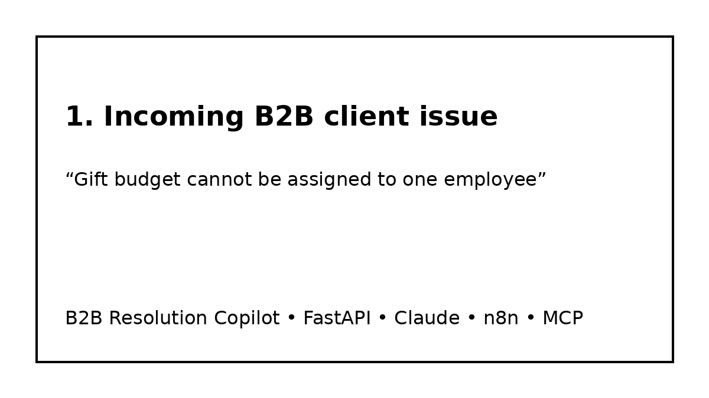
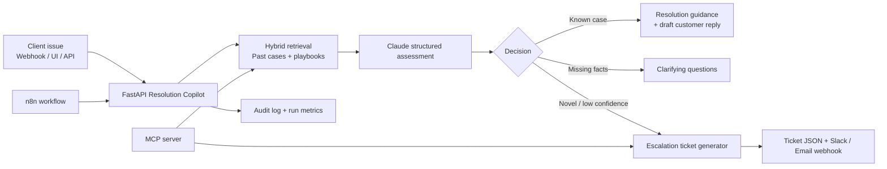

# B2B Resolution Copilot

> **An AI operations copilot for B2B customer teams:** retrieve similar historical cases, recommend the next best action, draft a customer-ready response, and automatically prepare a structured escalation ticket only when the case is genuinely new or low-confidence.



## Why this project exists

In B2B operations, support teams lose time on three recurring tasks:

1. **Searching internal knowledge** for “have we seen this before?”
2. **Reconstructing the resolution path** from scattered documents and old tickets.
3. **Creating clean escalation tickets** when an issue is truly new.

This repo demonstrates a practical AI automation that reduces that work without pretending the model should decide everything alone.

It is deliberately designed around a realistic employee-benefits / HR-tech context:
- companies are the B2B customers;
- employees are the end users;
- common issues include gift distribution, platform access, benefits eligibility, card/payment questions, and administration errors.

## What the copilot does

Given a client issue, the system:

1. Receives the issue via **API**, **Streamlit UI**, or **n8n webhook**.
2. Retrieves the most relevant internal precedents from a local knowledge base.
3. Uses **Claude** to produce a structured resolution assessment.
4. Returns one of three actions:
   - `RESOLVE_FROM_KNOWLEDGE`
   - `REQUEST_MORE_INFORMATION`
   - `ESCALATE_NEW_CASE`
5. Generates:
   - a concise operator summary,
   - recommended resolution steps,
   - a customer-facing draft reply,
   - a confidence score and cited evidence,
   - and, when needed, a pre-filled escalation ticket.

## Why this is portfolio-grade

This project demonstrates more than “calling an LLM API.” It shows:

- **AI agent design** with guardrails and structured outputs
- **RAG-style retrieval** over internal knowledge
- **n8n workflow orchestration** for business automation
- **API integration** via FastAPI
- **human-in-the-loop escalation logic**
- **operator-facing UI** for demoability
- **test coverage and CI**
- **documentation, architecture, and KPI thinking**
- **optional MCP server** exposing the same tools to agentic clients

## Architecture



## Repo structure

```text
swibeco-b2b-resolution-copilot/
├── README.md
├── .env.example
├── requirements.txt
├── Dockerfile
├── docker-compose.yml
├── Makefile
├── n8n/workflow.json
├── ui/app.py
├── scripts/demo_cli.py
├── src/resolution_copilot/
│   ├── app.py
│   ├── config.py
│   ├── schemas.py
│   ├── retrieval.py
│   ├── llm.py
│   ├── decision_engine.py
│   ├── ticketing.py
│   ├── notifications.py
│   ├── mcp_server.py
│   └── metrics.py
├── data/
│   ├── knowledge_base/
│   │   ├── cases.jsonl
│   │   └── playbooks.md
│   ├── sample_requests/
│   │   ├── known_gift_distribution_issue.json
│   │   ├── missing_context_issue.json
│   │   └── novel_refund_issue.json
│   └── generated_tickets/
├── tests/
├── docs/
│   ├── ARCHITECTURE.md
│   ├── PRODUCT_STORY.md
│   ├── DEMO_SCRIPT.md
│   ├── ROLE_ALIGNMENT.md
│   └── SECURITY.md
└── assets/demo.gif
```

## Quick start

### 1. Clone and install

```bash
python -m venv .venv
source .venv/bin/activate
pip install -r requirements.txt
```

### 2. Configure environment

```bash
cp .env.example .env
```

You can run the project in two ways:

- **Offline demo mode**: no API key required, deterministic mocked Claude logic for portfolio demos.
- **Live Claude mode**: add `ANTHROPIC_API_KEY` and set `LLM_MODE=anthropic`.

### 3. Start the API

```bash
uvicorn resolution_copilot.app:app --reload --app-dir src
```

Docs open at:
- `http://localhost:8000/docs`

### 4. Run a demo request

```bash
python scripts/demo_cli.py --scenario known
python scripts/demo_cli.py --scenario missing
python scripts/demo_cli.py --scenario novel
```

### 5. Run the Streamlit operator UI

```bash
streamlit run ui/app.py
```

### 6. Start the full Docker demo

```bash
make up
```

Services:
- API: `http://localhost:8000`
- UI: `http://localhost:8501`
- n8n: `http://localhost:5678`

## Example input

```json
{
  "client_company": "Alpine Robotics SA",
  "requester_role": "HR Operations Manager",
  "channel": "email",
  "subject": "Gift budget cannot be assigned to one employee",
  "message": "We tried to distribute a CHF 100 reward to a new employee, but the platform rejects the action. The employee was added yesterday and appears active in our HR export.",
  "metadata": {
    "employee_created_recently": true,
    "gift_amount_chf": 100
  }
}
```

## Example output

```json
{
  "decision": "RESOLVE_FROM_KNOWLEDGE",
  "confidence": 0.91,
  "operator_summary": "This likely matches a previously documented gift-assignment issue caused by synchronization delay or missing eligibility refresh for recently added employees.",
  "recommended_steps": [
    "Verify that the employee is present in the latest synchronized employee roster.",
    "Run or request the eligibility refresh for the employer account.",
    "Retry the gift assignment after the refresh completes.",
    "If the issue persists, escalate with the employee identifier and account ID."
  ],
  "draft_client_reply": "Thanks for flagging this. We found that this can happen when a newly added employee has not yet been fully refreshed in the eligibility data used for gift distribution. We recommend retrying after the account refresh, and we can help escalate immediately if the issue remains.",
  "similar_cases": [
    {
      "case_id": "CASE-GIFT-001",
      "score": 0.86,
      "why_relevant": "Same symptom: gift distribution blocked for a newly added employee."
    }
  ],
  "ticket_payload": null
}
```

## n8n workflow

Import:

```text
n8n/workflow.json
```

The workflow:
1. receives an issue through a webhook;
2. calls the FastAPI endpoint;
3. branches on the AI decision;
4. returns the result;
5. optionally sends a Slack notification for escalations.

See `docs/DEMO_SCRIPT.md` for a 60-second live demo walkthrough.

## MCP capability

The repo also includes a minimal MCP server:

```bash
python -m resolution_copilot.mcp_server
```

It exposes two tools:
- `search_similar_cases`
- `create_escalation_ticket`

This shows how the same internal capabilities could be made available to Claude Desktop or another MCP-compatible agent without rebuilding the business logic.

## Metrics that matter in production

The project logs every run and is designed around measurable operations outcomes:

- % of cases resolved from knowledge
- % of cases escalated
- average confidence by category
- top recurring issue categories
- escalation reasons
- average evidence score
- estimated handling-time reduction

See `docs/PRODUCT_STORY.md` for the PMO/business case.

## Tests

```bash
pytest -q
```

## Security & privacy

This repo intentionally:
- uses synthetic demo data only;
- stores secrets in `.env` variables;
- avoids silently auto-resolving low-confidence issues;
- keeps ticket creation auditable;
- separates retrieval evidence from generated text.

See `docs/SECURITY.md`.

## Resume / interview framing

> Built a B2B AI Resolution Copilot for operations teams that retrieves similar internal cases, recommends the next best action, drafts customer responses, and automatically prepares escalation tickets for genuinely novel issues. Implemented with FastAPI, Claude structured outputs, retrieval logic, n8n orchestration, an optional MCP server, and an operator-facing UI, with tests and CI for production-style delivery.
